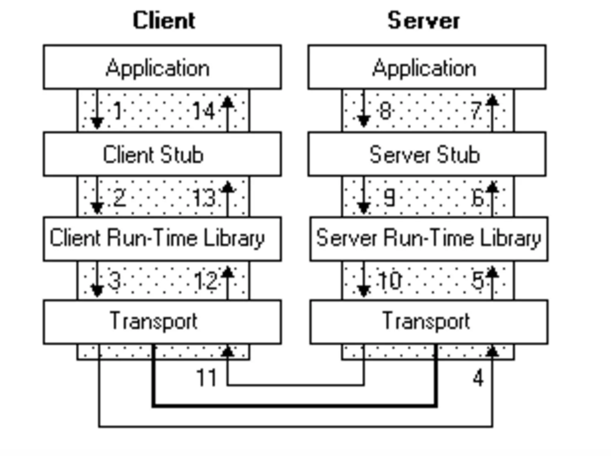
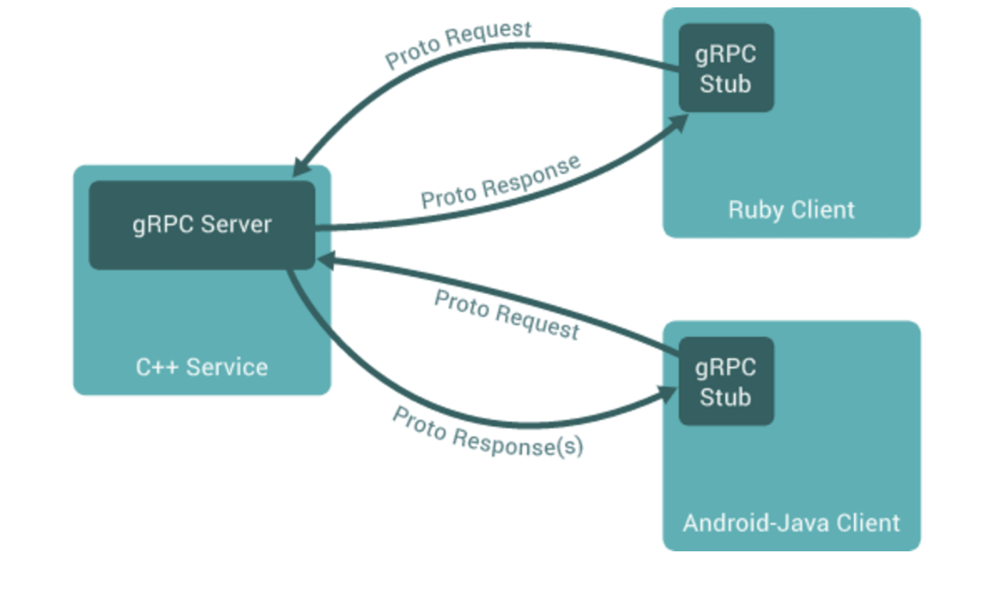

# **Implementing Remote Procedure Calls With gRPC and Protocol Buffers**


# Introduction To RPC

Remote procedure call (RPC) architecture is popular in building scalable distributed client/server model based applications.

RPC allows a client to make procedure call (also referred to as subroutine call or function call) to a server on a different address space without understanding the network configuration as if the server was in the same network (making a local procedure call).

In this tutorial, we will implement an RPC client/server model using Google's gRPC and Protocol Buffers.


# How RPC Works

Before we dive into the heart of RPC, let's take some time to understand how it works.


1. A client application makes a local procedure call to the client stub containing the parameters to be passed on to the server.
2. The client stub serializes the parameters through a process called marshalling forwards the request to the local client-time library in the local computer which forwards the request to the server stub.
3. The server run-time library receives the request and calls the server stub procedure which un-marshalls (unpacks) the passed parameters and calls the actual procedure.
4. The server stub sends back a response to the client-stub in the same fashion, a point at which the client resumes normal execution.





# Implementing RPC with gRPC and Protocol Buffers

Google managed gRPC is a very popular open source RPC framework with support of languages such as C++, Java, Python, Go, Ruby, Node.js, C#, Objective-C and PHP.

gRPC is a modern open source high performance RPC framework that can run in any environment. It can efficiently connect services in and across data centers with pluggable support for load balancing, tracing, health checking and authentication. It is also applicable in last mile of distributed computing to connect devices, mobile applications and browsers to backend services.

As we mentioned, with gRPC, a client application can directly call methods on a server application on a different network as if the method was local. The beauty about RPC is that it is language agnostic. This means you could have a grpc server written in Java handling client calls from node.js, PHP and Go.





gRPC allows you to define a service which specifies the methods that you can call remotely, the parameters that can be passed to the procedure call and return responses. The server then implements this definitions and creates a new grpc server to handle the procedure calls from the client.

By default, gRPC implements Protocol Buffers to serialize structured data as well as define the parameters and return responses for the callable methods


# Advantages Of Using The gRPC Framework

Before we get into your first RPC application with gRPC, it is good to look at why we should go for gRPC as opposed to other RPC frameworks such as Apache's [Thrift](https://thrift.apache.org/).


*   gRPC is built on [HTTP/2](https://http2.github.io/) under it's BSD license. What this means is that the procedure calls get the goodness of HTTP/2 to build real time applications taking advantage of features such as bidirectional streaming, flow control, header compression and multiplexing requests.
*   gRPC's default serialization protocol, Protocol Buffer, also transmits data in binary format which is smaller and faster as compared to good old JSON and XML.
*   Protocol buffer's latest version proto3 which makes it easy to define services and automatically generate client libraries as we will see later.


# Implementation


## Defining the protocol

First of all, you need to define the protocol, i.e. to define what can be said between client and server, and how. This is where Protobuf comes into play. It allows you to define two things: Services and Messages. A `service` is a collection of actions the server can perform at the client’s request, a `message `is the content of this request. To simplify, you can say that `service` defines **actions,** while `message` defines **objects**.

Write the following in `api/api.proto`:


```
syntax = "proto3";

package api;

message PingMessage {
 string greeting = 1;
}

service Ping {
 rpc SayHello( PingMessage ) returns ( PingMessage ) {}
}
```


So, you defined 2 things: a service called Ping that exposes a function called SayHello with an incoming PingMessage and returns a PingMessage ; and a message called PingMessage that consists in a single field called greeting which is a string.

You also specified that you are using the proto3 syntax, as opposed to proto2.

This file is not usable like this: it needs to get compiled. Compiling the proto file means generating code for your chosen language, that your application will actually call.


```bash
# Install protoc
## Run the below cmd from ../api directory

protoc -I api/ -I${GOPATH}/src --go_out=plugins=grpc:api api/api.proto
```


This command generates the file `api/api.pb.go`, a Go source file that implements the gRPC code your application will use. You can look at it, but you shouldn’t change it (as it will be overwritten every time you run protoc).

You also need to define the function called by the service Ping, so create a file named `api/handler.go`


```go
package api

import (
 "log"
 "golang.org/x/net/context"
)

// Server represents the gRPC server
type Server struct {
}

// SayHello generates response to a Ping request
func (s *Server) SayHello( ctx context.Context, in *PingMessage ) ( *PingMessage, error ) {
 log.Printf("Receive message %s", in.Greeting)
 return &PingMessage{ Greeting: "bar" }, nil
}
```


*   the Server struct is just an abstraction of the server. It allows to “attach” some resources to your server, making them available during the RPC calls;
*   the SayHello function is the one defined in the Protobuf file, as the rpccall for the Ping service. If you don’t define it, you won’t be able to create the gRPC server;
*   SayHello takes a PingMessage as parameter, and returns a PingMessage. The PingMessage struct is defined in the api.pb.go file auto-generated from the api.proto definition. The function also has a Context parameter. You’ll see later what use you can do of the Context. On the other side, it also returns an error, in case something bad happens.


## Creating the simplest server

Now you have a protocol in place, you can create a simple server that implements the service and understands the message. Take your favorite editor and create the file server/main.go:


```go
package main

import (
 "fmt"
 "log"
 "net"
 "../api"
 "google.golang.org/grpc"
)

// main start a gRPC server and waits for connection
func main() {
 // create a listener on TCP port 7777
 lis, err := net.Listen("tcp", fmt.Sprintf(":%d", 7777))
 if err != nil {
   log.Fatalf("failed to listen: %v", err)
 }

 // create a server instance
 s := api.Server{}
 // create a gRPC server object
 grpcServer := grpc.NewServer()
 // attach the Ping service to the server
 api.RegisterPingServer(grpcServer, &s)

 // start the server
 if err := grpcServer.Serve(lis); err != nil {
   log.Fatalf("failed to serve: %s", err)
 }
}
```


Let me break down to code to make it clearer:


*   note that you import the api package, so that the Protobuf service handlers and the Server struct are available;
*   the main function starts by creating a TCP listener on the port you want to bind your gRPC server to;
*   then the rest is pretty straight forward: you create an instance of your Server, create an instance of a gRPC server, register the service, and start the gRPC server.

You can compile your code to get a server binary:


```bash
go get -u google.golang.org/grpc
# In server dir
go build -i -v -o bin/server
```


## Creating the simplest client

The client also imports the api package, so that the message and the service are available. So create the file client/main.go


```go
package main

import (
 "log"
 "../api"
 "golang.org/x/net/context"
 "google.golang.org/grpc"
)

func main() {
 var conn *grpc.ClientConn

 conn, err := grpc.Dial(":7777", grpc.WithInsecure())
 if err != nil {
   log.Fatalf("did not connect: %s", err)
 }
 defer conn.Close()

 c := api.NewPingClient(conn)

 response, err := c.SayHello(context.Background(), &api.PingMessage{Greeting: "foo"})
 if err != nil {
   log.Fatalf("Error when calling SayHello: %s", err)
 }
 log.Printf("Response from server: %s", response.Greeting)
}
```


Once again, the break down is pretty straight forward:


*   the main function instantiates a client connection on the TCP port the server is bound to;
*   note the defer call to properly close the connection when the function returns;
*   the c variable is a client for the Ping service, that calls the SayHellofunction, passing a PingMessage to it.

You can compile your code to get a client binary:


```bash
# In client directory:
go build -i -v -o bin/client
```


# Make them talk

You’ve just built a client and a server, so fire them in two terminals to test them:


```bash
$ bin/server
2006/01/02 15:04:05 Receive message foo
$ bin/client
2006/01/02 15:04:05 Response from server: bar
```

# Secure the communication

The client and the servers talk to each other, over HTTP/2 (transport layer on gRPC). The messages are binary data ( thanks to Protobuf ), but the communication is in plaintext. Fortunately, gRPC has SSL/TLS integration, that can be used to authenticate the server ( from the client’s perspective ), and to encrypt message exchanges.

You don’t need to change anything to the protocol: it remains the same. The changes take place in the gRPC object creation, on both client and server side. Note that if you change only one side, the connection won’t work.

Before you change anything in the code, you need to create a self-signed SSL certificate. you can just use the files provided in the cert folder. The following commands have been used to generate the files:


```bash
$ openssl genrsa -out cert/server.key 2048
$ openssl req -new -x509 -sha256 -key cert/server.key -out cert/server.crt -days 3650
$ openssl req -new -sha256 -key cert/server.key -out cert/server.csr
$ openssl x509 -req -sha256 -in cert/server.csr -signkey cert/server.key -out cert/server.crt -days 3650
```


You can proceed and update the server definition to use the certificate and the key:


```go
package main

import (
 "fmt"
 "log"
 "net"
 "../api"
 "google.golang.org/grpc"
 "google.golang.org/grpc/credentials"
)

// main starts a gRPC server and waits for connection
func main() {
 // create a listener on TCP port 7777
 lis, err := net.Listen("tcp", fmt.Sprintf("%s:%d", "localhost", 7777))
 if err != nil {
   log.Fatalf("failed to listen: %v", err)
 }
 
// create a server instance
 s := api.Server{}

 // Create the TLS credentials
 creds, err := credentials.NewServerTLSFromFile("cert/server.crt", "cert/server.key")
 if err != nil {
   log.Fatalf("could not load TLS keys: %s", err)
 }

 // Create an array of gRPC options with the credentials
 opts := []grpc.ServerOption{grpc.Creds(creds)}
 // create a gRPC server object
 grpcServer := grpc.NewServer(opts...)

 // attach the Ping service to the server
 api.RegisterPingServer(grpcServer, &s)

 // start the server
 if err := grpcServer.Serve(lis); err != nil {
   log.Fatalf("failed to serve: %s", err)
 }
}
```


So what changed?


*   you created a credentials object (called creds) from your certificate and key files;
*   you created a grpc.ServerOption array and placed your credentials object in it;
*   when creating the grpc server, you provided the constructor with you array of grpc.ServerOption;
*   you must have noticed that you need to precisely specify the IP you bind your server to, so that the IP matches the FQDN used in the certificate.

Note that grpc.NewServer() is a variadic function, so you can pass it any number of trailing arguments. You created an array of options so that we can add other options later on.

You need to use the exact same certificate file on the client side. So edit the client/main.go file:


```go
package main

import (
 "log"
 "../api"
 "golang.org/x/net/context"
 "google.golang.org/grpc"
 "google.golang.org/grpc/credentials"
)

func main() {
 var conn *grpc.ClientConn

// Create the client TLS credentials
 creds, err := credentials.NewClientTLSFromFile("cert/server.crt", "")
 if err != nil {
   log.Fatalf("could not load tls cert: %s", err)
 }
 // Initiate a connection with the server
 conn, err = grpc.Dial("localhost:7777",   grpc.WithTransportCredentials(creds))
 if err != nil {
   log.Fatalf("did not connect: %s", err)
 }
 defer conn.Close()

 c := api.NewPingClient(conn)
 
 response, err := c.SayHello(context.Background(), &api.PingMessage{Greeting: "foo"})
 if err != nil {
   log.Fatalf("error when calling SayHello: %s", err)
 }
 log.Printf("Response from server: %s", response.Greeting)
}
```


The changes on the client side are pretty much the same as on the server:


*   you created a credentials object with the certificate file. Note that the client does not use the certificate key, the key is private to the server;
*   you added an option to the grpc.Dial() function, using your credentials object. Note that the grpc.Dial() function is also a variadic function, so it accepts any number of options;
*   same server note applies for the client: you need to use the same FQDN to connect to the server as the one used in the certificate, or the transport authentication handshake will fail.

Both sides use credentials, so they should be able to talk just as before, but in an encrypted way. You can compile the code:


```bash
# In client directory:
go build -i -v -o bin/client
# In server dir
go build -i -v -o bin/server
```


And run both sides in separate terminals:


```bash
$ bin/server
2006/01/02 15:04:05 Receive message foo
$ bin/client
2006/01/02 15:04:05 Response from server: bar
```